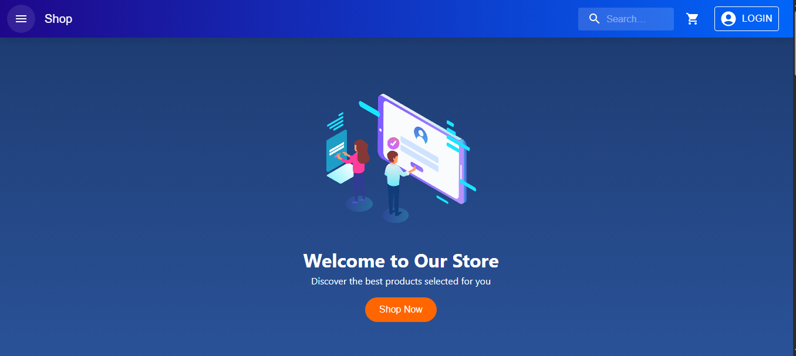

# E-commerce Mini App

A full-stack e-commerce application built with **Java Spring Boot** (backend) and **React** (frontend).

## 🎯 Features

- 📦 Product browsing and search
- 🛒 Shopping cart management
- 📋 Order placement and checkout
- 👨‍💼 Admin dashboard for order management
- 🔔 Order notifications and status tracking

## � Preview



[Click here to watch the video](./assets/preview.mp4)

## �📁 Project Structure

```
E-commerce-Mini-App/
├── backend/          # Spring Boot REST API
│   └── src/main/java/com/arssekal/backend/
│       ├── controllers/     # REST endpoints
│       ├── services/        # Business logic
│       ├── entity/          # Database models
│       ├── repository/      # Data access layer
│       └── dto/             # Data transfer objects
│
└── front_end/        # React + Vite frontend
    └── src/
        ├── components/      # Reusable React components
        ├── pages/           # Page components
        ├── contexts/        # Context API for state management
        ├── service/         # API service calls
        └── styling/         # CSS styles
```

## 🚀 Getting Started

### Prerequisites

- Java 11+ (for backend)
- Node.js 16+ (for frontend)
- Maven (for building backend)

### Backend Setup

```bash
cd backend
mvn clean install
mvn spring-boot:run
```

Backend runs on `http://localhost:8080`

### Frontend Setup

```bash
cd front_end
npm install
npm run dev
```

Frontend runs on `http://localhost:5173` (or port shown in terminal)

## 🛠️ Technology Stack

**Backend:**

- Java Spring Boot
- Maven
- MySQL(Database)

**Frontend:**

- React 18+
- Vite
- Context API (State Management)
- CSS

## 📝 API Endpoints

- `GET /api/products` - Get all products
- `POST /api/orders` - Create new order
- `GET /api/orders` - Get all orders
- `GET /api/admin/orders` - Admin view orders

## 👥 Project Developers

Built as a learning project for TarmzeAcademy React course.
